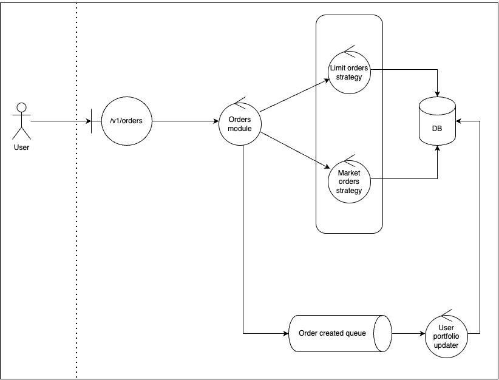
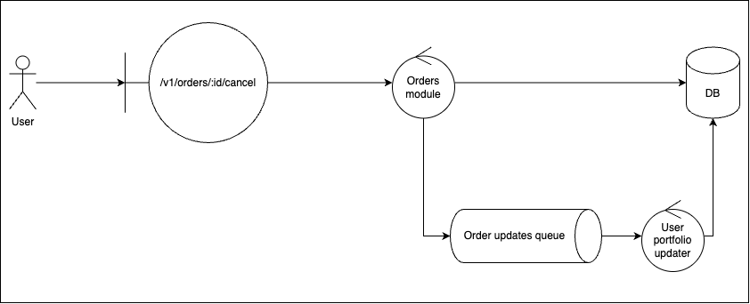
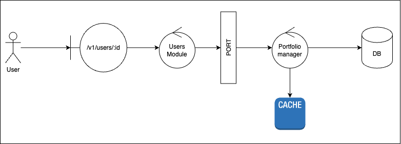

# Solucion

A continuación, detallo algunas decisiones de implementacion y gráficos ilustrativos sobre mi solución.

## Creacion de ordenes

Al momento de crear ordenes, los usuarios realizar el _request_ a la ruta `POST /v1/orders`. Dicha petición será procesada por el módulo de ordenes:
1. Validará el input del usuario
2. Validará si el usuario dispone del monto del activo para realizar dicha operación
3. Por medio de _estrategias_ para cada tipo de orden en el sistema, definirá montos, estado de la orden y almacenará la orden en la base de datos
4. Enviará un mensaje por medio de un _message broker_ indicando que se ha creado una nueva orden, y asi algun consumidor de estos mensajes (en este caso, el administrador de balances de los usuarios) podrá ejecutar alguna acción con la nueva orden creada.

Cuando se cancelen las ordenes:

1. Validará que la orden exista y pueda ser cancelada (solo las que tengan estado NEW pueden hacerlo)
2. Cancelará la orden, actualizando la base de datos
3. Enviara un mensaje por medio de un _message broker_ indicando que se ha actualizado una nueva orden.

En la práctica y por practicidad de la solución, el _message broker_ ha sido reemplazado por un emisor de eventos, utilizando el módulo de NodeJS de EventEmitter. La estructura hexagonal que tiene el proyecto facilitaría, en principio, la modificacion de esta implementacion mediante el uso de eventos por un _message broker_ propiamente dicho, como podria ser **RabbitMQ o BullMQ** (una solución más _lightweight_ montada en Redis).

## Consulta de Portfolio

Para la consulta de portfolio, los usuarios acceden por medio de la ruta `GET /v1/users/:idUser`. El módulo de usuarios delega la responsabilidad de la administración del portfolio de los usuarios al módulo de ordenes, accesible únicamente por medio de un `port/adapter`.

El módulo de ordenes utiliza el registro de ordenes del usuario de la base de datos para determinar monto disponible (en pesos) para utilizar, y balance de la cartera de activos que el usuario dispone hasta el momento.

Dado que estos balances no se verán alterados hasta que el usuario no opere nuevamente en el sistema (i.e: cree o actualice ordenes) y con el objetivo de optimizar la performance del sistema para determinar el portfolio de un user, el _portfolio manager_ utiliza un caché para no tener que re-calcular el balance de la cartera del usuario ante cada petición. El caché se verá invalidado y forzado a ser recalculado cuando el usuario realice alguna acción en sus ordenes.

El caché está implementado `en memoria` con la posibilidad de ser reemplazado por alguna solución mas robusta y escalable, como puede ser **Redis**.